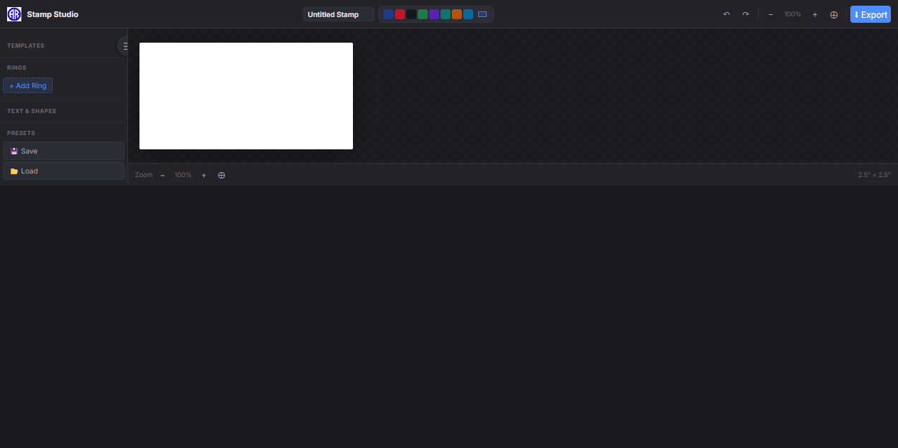

# Stamp Studio

> Free, open-source, browser-based **stamp & seal designer** with multi-language text support.

Design round, oval, rectangular, and custom stamps entirely in the browser — no server, no signup, no watermark. Export as PNG (transparent or white background) or vector SVG at up to 1200 DPI.


[](https://ar4web.github.io/FinalStamp/)

## ✨ Features

- 🎨 **Preset templates** — Circle, Double Ring, Triple Ring, Oval, Rectangle, Square, Minimal.
- 🔤 **Curved & straight text** with per-layer color, font, weight, letter spacing, and ring-channel snapping.
- 🌍 **Global language support** via the full Noto font family — Latin, Arabic, CJK (SC/JP/KR), Devanagari, Thai, Hebrew, and more.
- 🧱 **Layer system** — reorder, lock, hide, rename, duplicate, delete.
- 🖼️ **Custom logos & shapes** — import SVG/PNG or drop in built-in shapes (star, hexagon, cross, diamond…).
- 🎛️ **Effects** — ink bleed, grunge texture, rotation jitter for a realistic rubber-stamp look.
- 💾 **Presets & config** — save/load full stamp configurations as JSON.
- 🔍 **Free-pan canvas** with zoom HUD, fit-to-screen, 1:1, and alignment guides.
- ⌨️ **Keyboard shortcuts** for everything (`?` to view).
- 📱 **Responsive** — floating sidebar collapses on mobile.

## 🚀 Quick start

### Try it (no install)

Open `public/stamp/index.html` in any modern browser — the editor is a fully static app and runs offline.

### Run the full project locally

Requirements: [Bun](https://bun.sh) ≥ 1.1 (or Node ≥ 20).

```bash
git clone https://github.com/ar4web/FinalStamp.git
cd stamp-studio
bun install
bun run dev
```

Then open <http://localhost:8080>.

### Build for production

```bash
bun run build
```

## 🧭 Project structure

```
public/stamp/       Standalone stamp editor (framework-free HTML/CSS/JS)
  index.html        UI shell
  app.js            Canvas, layers, export logic
  style.css         Theme + layout
src/routes/         TanStack Start routes (React shell that hosts the editor)
src/components/     Shared React components
```

## 🛠️ Tech stack

- **TanStack Start v1** (React 19 + Vite 7) for the app shell
- **Tailwind CSS v4** with semantic design tokens
- Pure Canvas 2D for the stamp renderer — no heavy graphics libs
- Noto font family for multi-script text

## 🤝 Contributing

Contributions are welcome! Please read [CONTRIBUTING.md](./CONTRIBUTING.md) for setup, workflow, and coding conventions, and our [Code of Conduct](./CODE_OF_CONDUCT.md).

Good first issues:

- Add a new stamp template preset (`public/stamp/app.js` → `STAMP_TEMPLATES`)
- Improve RTL text rendering for Arabic/Hebrew curved layers
- Add PDF export
- Translate the UI

## 📸 Screenshots



▶ **[Live demo — ar4web.github.io/FinalStamp](https://ar4web.github.io/FinalStamp/)**

## 📄 License

[MIT](./LICENSE) — free for personal and commercial use. Attribution appreciated but not required.

## 🙏 Acknowledgements

- [Noto Fonts](https://fonts.google.com/noto) by Google — universal script coverage
- [TanStack Start](https://tanstack.com/start) — full-stack React framework
- Everyone who files bugs and sends PRs 💜
